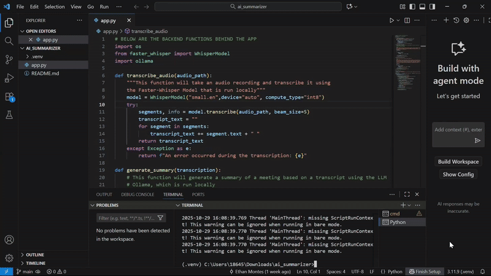

# 🤖 AI-Powered Meeting Summarizer & Action Item Extractor

This web application transcribes meeting audio, generates a concise summary, and extracts a structured list of action items using locally run AI models (Faster-Whisper and Ollama with Mistral).

---

## Demo



**Important Limitation:** Currently, the summarization and action item extraction may fail or produce inconsistent results on very long audio files (e.g., over ~10-15 minutes) due to the context window limits of the local LLM. See the "Limitations" section below.

---

## 🚀 Features

* **Local Audio Transcription:** Upload an audio file (MP3, M4A, WAV) and get a full text transcript using **Faster-Whisper** running locally.
* **Local Summarization:** Automatically generate a brief, professional summary using a local LLM (e.g., Mistral 7B or Phi-3 Mini) via **Ollama**.
* **Local Action Item Extraction:** Intelligently extract action items (Task, Owner, Deadline) using the local LLM and present them.
* **Simple Web Interface:** Easy-to-use interface built with **Streamlit**.
* **Privacy-Focused:** All AI processing happens on your machine; no data is sent to external APIs after initial model downloads.

---

## ⚙️ How It Works

The application follows a simple pipeline:

1.  **Upload:** User uploads an audio file via the Streamlit interface.
2.  **Transcribe:** The audio is processed locally by the `faster-whisper` model to generate text.
3.  **Process:** The *entire* transcript, along with specific instructions (prompts), is sent to the local LLM running via Ollama.
    * One prompt asks for a summary in a bulleted list.
    * Another prompt asks for action items in a labeled table.
4.  **Display:** The results generated by the local LLM are displayed in the Streamlit app.

---

## 🛠️ Technologies Used

* **Programming Language:** Python
* **Web Framework:** Streamlit
* **Speech-to-Text:** Faster-Whisper (local)
* **LLM Engine:** Ollama
* **LLM Models:** Mistral 7B / Phi-3 Mini (or others supported by Ollama)
* **Core Concepts:**
    * Natural Language Processing
    * Local AI Model Inference (Speech-to-Text, LLM)
    * Prompt Engineering
    * Building AI-powered Applications
    * Simple Web Development

---

## 📦 Setup & Installation (Local)

**Prerequisites:**
* Python 3.8+
* Ollama installed ([ollama.com](https://ollama.com/))

**Steps:**

1.  **Clone the Repository:**
    ```bash
    git clone [https://github.com/your-username/ai-summarizer.git](https://github.com/your-username/ai-summarizer.git)
    cd ai-summarizer
    ```

2.  **Create and Activate Virtual Environment:**
    ```bash
    python -m venv venv
    # Activate (example for Mac/Linux):
    source venv/bin/activate
    ```

3.  **Install Dependencies:**
    *(Create a `requirements.txt` file: `pip freeze > requirements.txt`)*
    ```bash
    pip install -r requirements.txt
    ```

4.  **Download Ollama Model(s):**
    ```bash
    # Example:
    ollama pull mistral
    # or
    ollama pull phi3:mini
    ```

5.  **Run the Streamlit App:**
    ```bash
    streamlit run app.py
    ```

---

## Usage

1.  Ensure Ollama is running in the background.
2.  Launch the application: `streamlit run app.py`.
3.  Upload a **short to medium length** audio file (MP3, WAV, etc.).
4.  Click the "Generate Summary and Action Items" button.
5.  Wait for local processing to complete.
6.  View the results!

---

## ⚠️ Limitations & Future Work

* **Context Window Limit:** The primary limitation is the context window of the local LLM. Long transcripts (from audio > ~10-15 mins) can exceed this limit, causing the LLM to "forget" formatting instructions or fail to process the full text, leading to incomplete or poorly formatted summaries and action items.
* **CPU Performance:** Running transcription and LLM inference on a CPU can be slow (potentially 10-20+ minutes depending on hardware and audio length). GPU acceleration (via Ollama if supported, or by running Whisper on GPU) significantly speeds this up with the entire process being reduced to a minute or two.

**Future Improvements:**
* `[ ]` **Implement Chunking (MapReduce):** Break long transcripts into smaller pieces to reliably process audio of any length within the LLM's context window.
* `[ ]` **Add Speaker Diarization:** Use a library like `pyannote.audio` to identify *who* is speaking and incorporate this into the action item extraction logic.
* `[ ]` **Optimize Performance:** Explore further quantization or different model backends (like llama.cpp directly) for potential speed improvements on CPU.
* `[ ]` **Error Handling:** Improve robustness for edge cases and model failures.
